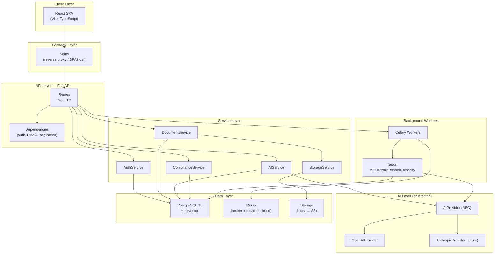
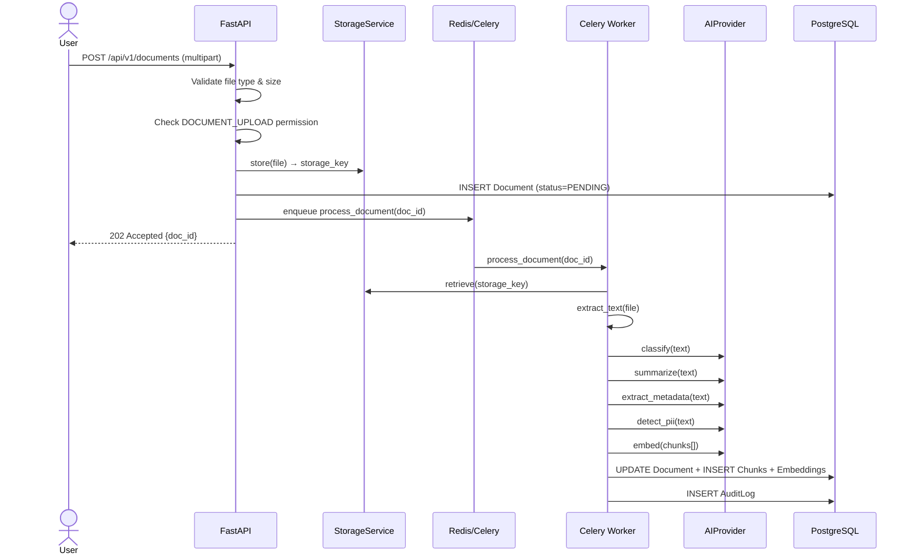
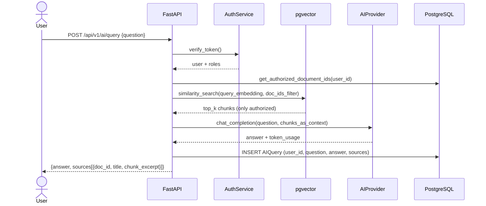

# Architecture Decision Records & Component Diagram

## AI-Powered Secure Document & Compliance Platform

---

## High-Level Component Architecture



---

## Data Flow: Document Upload → AI Processing



---

## Data Flow: RAG Query (Authorization-first)



---

## ADR-001 — Technology Choices

**Date**: 2026-08-20  
**Status**: Accepted

### Context
We need a production-ready AI document platform that is maintainable, testable, and demonstrable in a portfolio/interview context.

### Decisions

| Concern | Decision | Rationale |
|---|---|---|
| Backend language | Python 3.11 | Rich AI/ML ecosystem; FastAPI is production-proven |
| API framework | FastAPI | Async-native, OpenAPI auto-docs, Pydantic v2 integration |
| ORM | SQLAlchemy 2 (async) | Industry standard, full Alembic support |
| Database | PostgreSQL 16 | Rock-solid; pgvector extension for embeddings in same DB |
| Vector search | pgvector | Avoids external vector DB dependency; single DB to operate |
| Frontend | React 18 + Vite + TypeScript | Specified in requirements; fastest dev-server startup |
| Auth | JWT + refresh tokens | Stateless, scalable; bcrypt for password hashing |
| Background tasks | Celery + Redis | De-facto Python standard; supports retries, monitoring |
| AI abstraction | `AIProvider` ABC | Prevents vendor lock-in; OpenAI as first concrete impl |
| Storage abstraction | `StorageService` ABC | Local for dev, S3-compatible for prod; no code changes |
| Container | Docker + Docker Compose | Reproducible local environment; CI-friendly |

### Rejected Alternatives

| Alternative | Reason Rejected |
|---|---|
| Django | More opinionated; FastAPI better for API-first async backends |
| Separate vector DB (Pinecone, Weaviate) | Operational complexity; pgvector is sufficient at this scale |
| GraphQL | REST is simpler, better understood, sufficient for this use case |
| Next.js | React + Vite is lighter; SSR not needed for this SPA-style app |

---

## ADR-002 — AI Security: Authorization-First RAG

**Date**: 2026-08-20  
**Status**: Accepted

### Decision
The RAG pipeline **must** filter vector search results to only include chunks belonging to documents the requesting user is authorized to view.

Authorization happens **before** the vector search query, not after. The similarity search receives an explicit `doc_ids` filter.

### Rationale
Post-retrieval filtering is error-prone. If a bug allows an unauthorized chunk into the LLM context, sensitive information could leak into the AI's answer even if the chunk is later discarded. Filtering at the query level is the safe default.

### Implementation
```sql
-- Vector search with authorization filter (pgvector)
SELECT chunk_id, content, embedding <=> $query_embedding AS distance
FROM document_chunks
WHERE document_id = ANY($authorized_doc_ids)
ORDER BY distance
LIMIT $top_k;
```

---

## ADR-003 — No Secrets in Code

**Date**: 2026-08-20  
**Status**: Accepted

All secrets (database passwords, JWT keys, API keys) are loaded from environment variables via `pydantic-settings`.  
The `.env.example` file contains placeholder values and is committed.  
The `.env` file is in `.gitignore` and is never committed.
